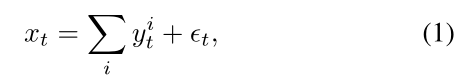
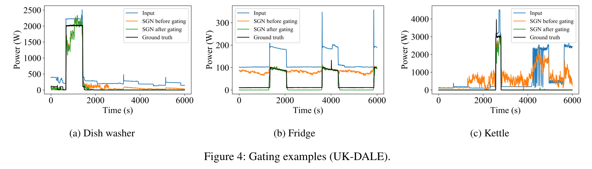

# Subtask Gated Networks for Non-Intrusive Load Monitoring

## Abstract

- **非侵入式负载监控** (`NILM`)，也称为能源分解，是一种**盲源分离**问题，将**家庭总用电量分解为单个电器的用电量**。这样就可以避免在众多的家用电器上安装多个测量设备的成本和麻烦，并且只需要安装一个设备。自 1992 年 Hart 的开创性论文以来，这个问题就广为人知，最近通过采用深度网络已经实现了显着的性能改进。在这项工作中，我们专注于设备具有开/关状态的想法，并开发一个深度网络以进一步提高性能。具体来说，我们提出了一个**子任务门控网络**，它将**主回归网络**与**开/关分类子任务网络**相结合。与典型的多任务学习算法（多个任务简单地共享网络参数以利用任务之间的相关性）不同，子任务门控网络将主网络的回归输出与子任务的分类概率相乘。当额外了解待机功率时，所提出的解决方案在大多数基准情况下都超过了最先进的性能。子任务门控网络对于本质上具有开/关状态的任何问题都非常有效。

## Introduction

- 非侵入式负载监控 (`NILM`) 由 Hart 于 1992 年首次提出，它是通过将总耗电量作为唯一输入来估计单个设备的耗电量的过程 (Hart 1992)。因为多个设备的功耗相加形成聚合消耗，并且由于 `NILM` 的目标是从单个传感器测量的总功耗中分解每个设备的功耗，所以 `NILM` 也称为能量分解。**分解后的能源消耗信息可用于向消费者提供反馈并影响他们的能源消耗行为**，例如 Neenan 等人。表明可以实现 **15% 的节能**（Neenan、Robinson 和 Boisvert 2009）。此外，`NILM` 可用于**检测故障电器**、**设计能源激励措施和管理需求响应** (Froehlich et al. 2010)。作为示例性用例，**公用事业公司**可以识别在高峰时段哪些家庭正在运行特定的电器（例如空调），并采取适当的措施来减少用电量。

- 在过去几年中，深度学习已成为 `NILM` 的一种流行方法（Kelly 和 Knottenbelt 2015；Huss 2015；Zhang 等人 2018）。这些作品通过应用主要在其他领域开发的深度学习算法，展示了改进的 `NILM` 性能。然而，**以前的工作并没有明确利用用电量数据的固有属性**。在我们的工作中，我们利用这些属性之一，即我们可以在图 1 中观察到的设备的开/关状态概念。我们提出了子任务门控网络 (`SGN`)，它采用一个 `DNN` 进行**回归**，另一个 `DNN` 进行**开/关分类**。通过将回归输出与分类概率**相乘**以形成最终估计，该模型输出使用开/关分类门控的功率估计。通过明确反映分类错误的损失函数，分类子网络充当基于开/关的门。 `SGN` 在 `REDD` 和 UK-DALE 中的表现平均提高了 15-30%。此外，我们进一步研究了反映待机功率和硬门控的变体，这表明某些设备有额外的改进。 

## Related Works

### Non-intrusive load monitoring

- `NILM` 最常用的方法是**阶乘隐马尔可夫模型** (`FHMM`)（Ghahramani 和 Jordan 1997）及其变体（Kim 等 2011；Kolter 和 Jaakkola 2012；Parson 等 2012；Zhong、Goddard 和 Sutton 2014 ; Shaloudegi 等人，2016 年）。金等人提出了一种**基于条件因子隐藏半马尔可夫模型的能量分解算法**，该算法利用了与何时以及如何使用电器相关的附加特征（Kim et al. 2011）。Kolter 和 Jaakkola 提出了一种**基于凸优化推理的近似阶乘隐马尔可夫模型**，该模型聚合了聚合能量数据的差异信号和其他约束（Kolter 和 Jaakkola 2012）。帕森等人表明 `FHMM` 中的先前设备模型可以应用于现实世界的能源分解系统（Parson 等人，2012 年）。钟等人将信号聚合约束 (`SAC`) 合并到**加性因子隐马尔可夫模型**中，显着改进了原始加性因子隐马尔可夫模型 (Zhong、Goddard 和 Sutton 2014)。 Shaloudegi 等人。通过结合凸半定松弛随机舍入和可扩展的 `ADMM` 优化算法（Shaloudegi 等人，2016 年），增强了钟等人的算法。
- 最新的方法基于**深度学习**。杰克凯利等人尝试了各种深度学习模型，包括卷积神经网络 (`CNN`)、递归神经网络 (`RNN`) 和去噪自动编码器 (`DAE`) (Kelly and Knottenbelt 2015)。 Huss 提出了一种**基于 CNN 和隐藏半马尔可夫模型的混合能量分解算法**（Huss 2015）。张等人建议使用 **CNN 进行序列到点**学习，以便将时间窗口的单个中点视为网络的输出，而不是窗口的整个序列（Zhang et al. 2018）。虽然显示出显着的性能改进，但没有一种方法利用端到端训练的设备的开/关状态。

### Multi-task learning

- 我们的工作受到多任务学习 (`MTL`) 的启发。一般来说，多任务学习通过与**特定任务损失函数**相关的多个任务进行学习（Ruder 2017）。多任务学习方法通过在**相关任务之间共享参数**，使模型能够更好地概括原始任务。 Caruana 将 `MTL` 的目标总结如下：“`MTL` 通过利用相关任务的训练信号中包含的特定领域信息来提高泛化能力”（Caruana 1998）。
- 大多数多任务学习研究都集中在通过多个任务之间的**低层参数共享**来提高主要任务或所有任务的性能（Zhang et al. 2014; Yu and Jiang 2016; Liu et al. 2015; Cheng, Fang, and Ostendorf 2015 ）。例如，在 Zhang 等人的工作中，头部姿态估计和面部属性推断任务被用作辅助任务，除了参与每个任务输出的最后一层参数外，它们共享参数。这些相关任务通过学习更好的参数值来改进面部标志检测任务（Zhang et al. 2014）。
-  本文提出的架构，子任务门控网络，可以解释为具有分类辅助任务的多任务学习。但是，使用子任务输出的方式存在重大差异。在我们的工作中，辅助任务输出作为**乘法单元**来计算主任务的最终输出，这超出了通过损失函数间接影响主任务的参数共享。

### Gating mechanism

- 深度学习中的**门控机制**意味着使用 `sigmoid` 或 `softmax` 函数软选择两个或多个组件中的一个。例如，`sigmoid` 已被广泛用于确定是否应在循环神经网络中记住隐藏状态（Hochreiter 和 Schmidhuber 1997；Gers 和 Schmidhuber 2000；Cho 等人 2014）。作为另一个例子，在**专家混合**中（Jacobs et al. 1991），`softmax` 已被用于决定每个输入区域使用哪个专家。然而，在这些例子中，门控网络不能明确地从门控任务本身学习。相反，这些示例使用 `EM 算法`或反向传播，其损失函数与最终输出相关，而不是门控本身。在我们的子任务门控网络中，我们使用可用的辅助任务标签添加了一种`门控损失`，这使得我们的模型直接从开/关门控任务中学习。

## Preliminary

### Problem formulation of energy disaggregation

- 给定时间 $T$ 时段的**总功耗**为$ x = (x_1, x_2, · · · , x_T)$，令 $y^i = (y^i_1, y^i_2, · · · , y^i_T)$ 表示房屋中**第$ i $个电器的功耗。**在每个时间步，总功耗可以表示为各个功耗的总和，如下所示

  

  - 其中 $\epsilon _t$是假设为均值为零且方差为$\sigma^2_t$的**高斯噪声**。假设我们只对 $I$ 电器感兴趣，它是大多数家庭中广泛使用的家用电器。然后，**未知**设备的功耗可以表示为$ u = (u_1, u_2, · · · , u_T)$，并且$ (1) $可以重新表示为

    

  - 然后分解问题是从$ x $**估计**电器 $y^1、y^2、····、y^I $的**功耗序列**。

### Deep neural networks for energy disaggregation

- 在之前的研究中（Kelly 和 Knottenbelt 2015；Zhang 等人 2018），用于**非线性回归的深度神经网络**用于从聚合功耗序列中估计单个设备的功耗。出于实际原因，深度神经网络使用从 $t$ 开始的部分序列 $x_{t,s} := (x_t, · · · , x_{t+s−1}) $和$ y^i_{t,s} := (y^i_t, · · · , y^i_{t+s−1})$分别以长度 $s$ 作为输入和输出，而不是$ x $和$ y^i $的整个序列。为了**避免上下文信息的丢失**，我们可以考虑在两端添加长度为$ w $的窗口，仅用于输入。准确地说， $\tilde{x}_{t,s,w} := (x_{t−w}, · · · , x_{t+s+w−1}) $作为输入， $y^i_{t,s}$ 作为输出。由于序列长度$ s $和附加窗口长度 $w $在本文中是**固定**的，为了简单起见，我们将省略符号上的下标$ s $和$ w$。在我们的工作中，我们将**电器功率估计模型**表示为：$f^i_{power} : \mathbb{R}^{s+2w}_+ \rightarrow \mathbb{R}^{s}_+ $，**单个电器**的定义为

  

- 尽管 `RNN` 架构广泛用于序列建模（Sutskever、Vinyals 和 Le 2014），但 `CNN` 也是解决能量分解问题的有吸引力的解决方案，并且表现出比 `RNN` 架构更好的性能（Kelly 和 Knottenbelt 2015；Huss 2015；Zhang 等人。 2018）。最近，一项实证研究表明，`CNN` 在各种序列建模任务和数据集上的表现都优于 `RNN`（Bai、Kolter 和 Koltun 2018）。当我们尝试一些 `RNN` 来解决我们的问题时，即使训练时间更长，它们的性能也比 `CNN` 差。因此，本研究不包括 `RNN`，我们只考虑 Zhang 的论文中使用的 `CNN` 模型（Zhang et al. 2018）。

## Subtask Gated Networks (`SGN`)

### Auxiliary classification subtask for `NILM`

- 我们的通用框架使用辅助分类子任务作为主要回归任务的门控单元，如图 2 所示。使用子任务，我们可以以显式方式利用开/关状态。准确地说，我们可以将开/关分类制定为非侵入式负载监控的子任务。

  

- 令 $o^i = (o^i_1, o^i_2,···, o^i_T )$ 为电器 $i $的状态序列，其中 $o^i_t ∈ \{0, 1\} $表示电器 $i $在时间$ t$ 的开/关状态：

  

- 同样，我们使用符号 $o^i_{t,s} := (o^i_t, · · · , o^i_{t+s−1}) $表示部分序列。只要序列长度 $s$ 是固定的，下标$ s $就会被省略。然后，我们定义了一个神经网络$f^i_{on} : \mathbb{R}^{s+2w}_+ \rightarrow \left [ 0, 1 \right ]^s$用于电器$ i$ 的开/关状态分类，即映射：

  

  - 我们要强调的是，$\hat{o}^i_t$ 中的每个元素都表示设备处于**开启状态**的概率。

- 我们将结构的最终输出$f^i_{output}$定义为

  

  - $\bigodot$表示逐元素乘法

- 那么，这种架构自然会引出以下**损失函数** 

  

  - 请注意，$L^i_{output} $和$ L^i_{power} $分别是功率估计任务的整个网络和回归子网络中的**均方误差损失**。 $L^i_{power}$ 是文献中使用的损失函数（Kelly and Knottenbelt 2015; Zhang et al. 2018）。 $L^i_{on}$ 是分类子网络中的 **`sigmoid` 交叉熵损失**。

### Loss function

- 在我们的工作中，我们使用以下损失函数进行**联合优化**：

  

  - 该损失函数表示整体网络损失和分类子网损失的总和。我们的模型可以仅使用 $L^i_{output} $进行训练，但是 $L^i_{on} $直接将开/关状态信息注入分类子网络。它诱导分类子网络作为开/关门运行，并且使用 $L^i_{output} $和  $L^i_{on} $ 显示出更好的性能。整个网络的损失函数及其梯度为：

  

  - 上面的方程表明，回归子网络仅在分类子网络将目标设备的状态分类为“开启”状态时学习。但是，如果分类子网络对于输入饱和为零，则功率估计子网络无法学习，因为梯度也为零。对于这种情况，如果回归子网络输出非零值，则最小化$\partial L^i_{output} / \partial \hat{o}^i_j$可以稍后恢复分类网络。

### Variants of subtask gated networks for `NILM`

- 在这里，我们考虑了几个选项来提高 `SGN` 对 `NILM` 问题的性能。

  

- 具有备用电源的 `SGN (SGN-sp)` 设备即使在“关闭”状态下也可能具有**非零功耗**。通过分析数据，我们很容易确定**待机**功率，如表 1 所示。它们可能看起来很小，但它们不可忽略，因为“关闭”状态占用了很大一部分时间。由于 `SGN` 假设设备处于“关闭”状态时的功耗为零，因此需要稍作修改以考虑待机功率。考虑到电器处于“关闭”状态时待机功率是一个固定值，公式可以简单修改如下:

  

- `Hard SGN` 不是将功率估计值直接乘以分类子网的概率输出，而是根据分类子网的输出将功率估计乘以 0 或 1 可能更符合开关门的含义。硬门控可以简单地通过应用条件函数 $g(x) $来实现，使得

  

- 我们还可以使用修改后的输出公式直接推导出 `Hard SGN-sp` 模型，如下所示：

## Experiments

### Experiment settings

- **数据集**。 我们在两个真实世界数据集 `REDD` (Kolter and Johnson 2011) 和 `UKDALE` (Kelly and Knottenbelt 2014) 上评估我们提出的方法。 `REDD` 数据集包含 6 个美国房屋的数据，`UK-DALE` 数据集分别包含 5 个英国房屋的用电量数据。

  - 在 `REDD` 中，**每 1 秒**记录一次**总耗电量**，并且在不同的持续时间内**每 3 秒**记录一次电器耗电量。该数据集包含总功耗和 **10-25 种电器**的测量值。然而，我们只考虑**微波炉、冰箱、洗碗机和洗衣机**，就像之前的工作一样（Zhang et al. 2018）。我们使用 2-6 号房屋的数据作为训练集，1 号房屋作为测试集。

  - 在 `UK-DALE`，从 2012 年 11 月到 2015 年 1 月，**每 6 秒**记录一次所有数据。数据集包含 4-54 台设备的主要汇总功耗和测量值。在我们的实验中，我们只考虑**水壶、微波炉、冰箱、洗碗机和洗衣机**。对于评估，我们使用房子 1 和 3-5 进行训练，使用房子 2 进行测试，就像之前的工作一样（Zhang et al. 2018）。我们只使用了预处理后发布的上周数据1。

- **数据预处理**。 由于 `UK-DALE` 数据集已由 Jack Kelly (Kelly and Knottenbelt 2015) 进行预处理，因此我们按原样使用它。对于 `REDD` 数据集，我们使用以下过程进行预处理以**处理缺失值**。首先，我们拆分序列，使子序列中缺失值的持续时间小于 20 秒。其次，我们通过反向填充方法填充了每个子序列中的缺失值。最后，我们只使用了持续时间超过一天的子序列。对于 `UKDALE` 和 `REDD` 数据，总功耗和电器功耗除以总功耗的标准差。

- **神经网络训练细节**。作为基线，使用 `NILMTK` 中的 `FHMM` 实现来评估 `FHMM` 的性能，`NILMTK` 是一种用于分析能量分解的开源工具包（Batra 等人，2014 年）。 Jack Kelly 的去噪自动编码器 (`DAE`) 和 Zhang 的 `CNN (Seq2Seq)` 是根据每篇论文 (Kelly and Knottenbelt 2015; Zhang et al. 2018) 中描述的架构进行评估的。我们的模型架构如图 3 所示。该架构使用 Zhang 的 `Seq2Seq` 作为两个子网络，因为神经网络架构本身并不是我们工作的主要重点。每个架构的更多细节可以在补充文档中找到。我们的模型具有以下超参数。学习率为$ 1.0 × 10^{−4}$，`batch size` 为 16。开/关分类任务的标签是根据等式（4）使用 15 瓦作为**阈值**生成的。 `DNN` 模型在 `NVIDIA GTX 1080Ti` 上进行训练，并使用 TensorFlow 1.8 包实现。 `He 初始化`（He et al. 2015）用于所有神经网络架构的权重。对于 `REDD`，使用额外的窗口大小 $w=400 $和输出序列长度$ s=64$，对于 `UK-DALE`，$w=200 $和$ s=32$ 对数据进行切片，其中输入是 43.2 分钟的序列，输出是 3.2 分钟的序列分钟。我们使用 `Adam` 优化器（Kingma and Ba 2015）进行训练。

​	

- **评估指标**。在本实验中，使用 `MAE`（平均绝对误差）和 $SAE_{\sigma}$（每次 $\sigma$ 周期的信号聚合误差）来评估性能。 `MAE` 是用于回归问题的通用度量，它显示了模型在 `NILM` 中执行功耗估计的能力。 $SAE_{\sigma}$表示 $\sigma$  时间段内的**平均总误差**，它比较了 **δ** 时间段内`GT`实况和估计的总和。我们使用信号聚合误差 (`SAE`) 的**时间归一化**版本。与之前的 `SAE`（Zhang et al. 2018）中的原始 `SAE` 通过总结来考虑整个周期的功耗不同，我们比较了**每小时的使用量**，因为这可能是关于能耗行为控制的一个更重要的概念。请注意，$SAE_{\sigma}$是使用时间段（一小时）进行归一化的，而不是像以前的作品那样使用`GT`实况功耗（Zhang et al. 2018）。虽然它使不同电器之间的一一比较困难，但它可以防止在电器处于“关闭”状态时因分母接近零和除以零而导致的异常值。

​	

### Experiment results

- 表 2 和表 3 显示了 `REDD` 和 `UK-DALE` 数据集的先前工作和 `SGN` 的性能。在这两个表格中，粗体字表示每个设备的最佳性能算法，阴影表示 `SGN` 的性能优于之前的最佳算法。对于 `MAE`，我们可以看到使用 `SGN-sp` 的 9 个案例中的 9 个以及使用 `SGN` 的 9 个案例中的 7 个的性能得到了改进。对于 `SAE`，使用 `SGN` 或 `SGN-sp` 的 9 个案例中有 6 个的性能得到了改善。平均而言，与最先进的技术相比，`SGN` 和 `SGN-sp` 的错误性能降低了 15-30%。这些性能改进是在没有微调任何网络架构、超参数或 $L_{output }$和$ L_{on} $之间的权重的情况下实现的。$Hard\  SGN $的平均性能往往比 $SGN $差，但仍比以前的作品表现更好，并且观察到冰箱和微波炉的显着改进。在现实世界中，我们不需要将单个模型应用于所有设备。我们可以根据设备类型从 `SGN` 及其变体中进行选择。

- 图 4 显示了分类子网如何与回归子网交互的三个示例。图中，`SGN before gating`代表 $\hat{p}^i_t$，`SGN after gating`分别代表$\hat{p}^i_t \cdot \hat{o}^i_t $。在洗碗机的情况下，门控主要用于在洗碗机真正处于“关闭”状态时过滤掉小的嘈杂回归估计。在冰箱的情况下，即使冰箱明显处于“关闭”状态，回归子网络也会估计“开启”状态的功耗。分类子网络完全负责决定它是“开”还是“关”，门控后的最终输出结果非常准确。在水壶的情况下，回归子网络似乎在“关闭”状态下有嘈杂的输出，就像在洗碗机的情况下一样。但是，噪音并不像洗碗机那样小。当其他电器打开时，水壶的回归子网络输出似乎受到强烈影响，并导致大值输出。然而，分类子网络再次完成门控工作，最终输出变得准确。

- 图 5 显示了**分类子网络**的输出  $\hat{o}^i_t$ 的直方图。请注意，$y$ 轴采用**对数**刻度，以正确显示0和1附近的大计数。尽管主要目标是回归任务，但很大一部分$\hat{o}^i_t$ 值集中在0和1附近。这是因为除了 $L_{output} $之外，成本函数中还包含$ L_{on}$。包括 $ L_{on}$会影响回归子网和分类子网的协作方式。为了说明这一点，我们生成了与图 4(b) 相同的图，但这次不包括 $ L_{on}$。结果如图 6 所示。由于 $ L_{on}$没有明确包含在成本函数中，因此不需要很好地执行分类任务，并且子门控网络可以自由决定要对两个子网络做什么。在图 6(a) 中，可以看出分类子网络成为一个比例因子，其中回归子网络只是高估了“开启”状态。当如图 6(b) 所示比较“开启”概率直方图时，很明显分类子网络未能达到预期的效果。通过将$ L_{on}$ 添加到成本函数中，我们可以防止子门控网络被混淆，从而获得更好的性能。回到图 5，可以看出“开启”概率反映了电器的实际功能。对于在“开”和“关”之间循环的冰箱，在概率零和概率一附近可以看到大致相同的计数。另一方面，洗碗机和水壶的计数偏斜，众所周知，这些洗碗机和水壶在大多数时间都是关闭的。

- **对 $SAE _{\sigma}$的 $\sigma$  敏感性分析**。 在实践中，`NILM` 需要以不同的方式使用。有时应用程序需要每个设备每小时的能源使用量，但有时也可能需要一天或一个月的使用量。根据应用的要求，需要适当地选择$\sigma$ 。为了了解 `SGN` 是否适用于不同的$\sigma$ 选择，我们在图 7 中将 $SAE _{\sigma}$ 绘制为$\sigma$  的函数。正如预期的那样，随着$\sigma$ 的增加，性能会变得更好，因为正负误差可以有机会抵消。 `SGN` 是所检查的整个 $\sigma$  范围内性能最佳的算法。

## Conclusions

- 在这项工作中，我们提出了对开/关状态的回归问题有效的子任务门控网络。对于非侵入式负载监控的应用，评估了 `REDD` 和 `UK-DALE` 数据集的性能。当使用 `MAE` 和$SAE _{\sigma}$ 作为指标时，我们提出的解决方案的性能比最先进的深度学习解决方案好 15-30%。结果表明，将回归子网和分类子网结合起来是提高具有开/关状态的回归任务性能的一个有希望的方向。

- 未来的研究可能会扩展到两个可能的方向：
  - **首先是概括如何将设备状态信息反映到模型中**。我们的方法只处理电器的开/关状态，但有些电器有**多种**状态。可以通过创建超出开/关状态的精确标签信息来使用这些信息。
  - 二是将我们的方法**扩展到具有类似开/关属性的其他域的数据**。我们的方法可以应用于任何回归问题，我们可以生成一个描述与输出相关的离散状态的辅助类。