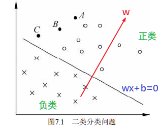
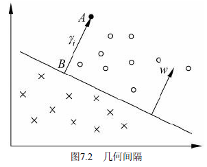
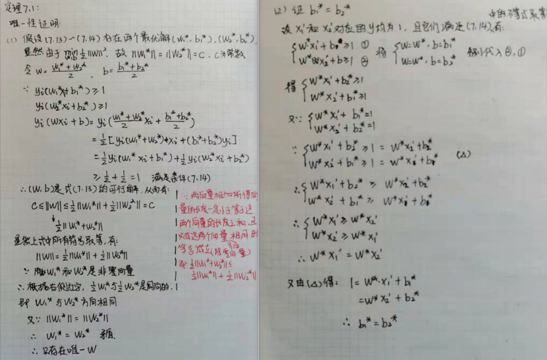
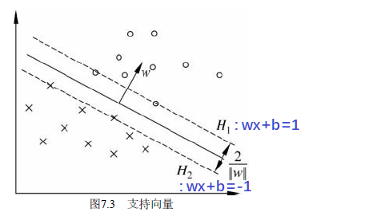
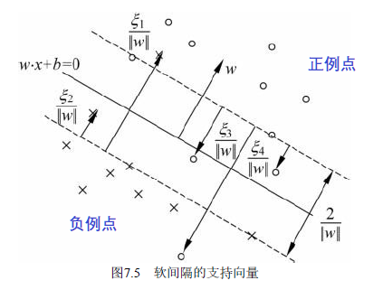
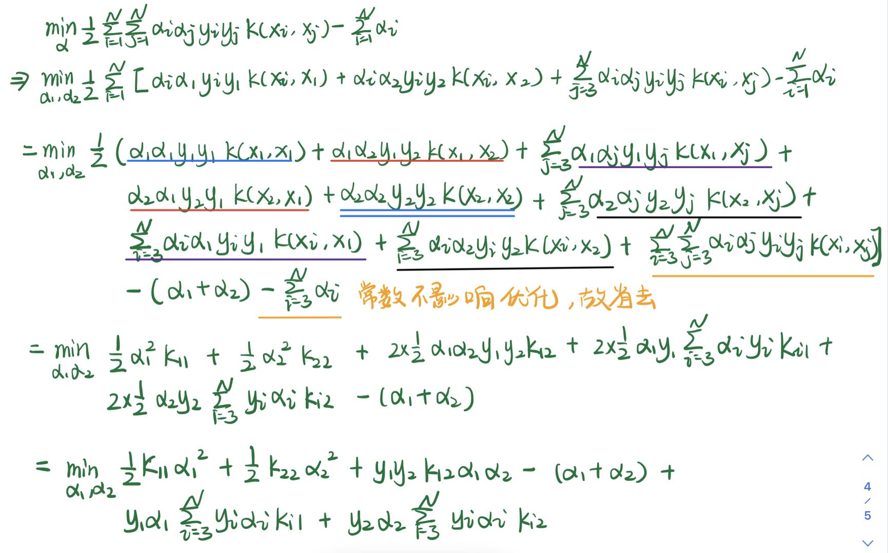

# 第7章 支持向量机

- 支持向量机`SVM`

  - 一种二分类模型
  - 定义在特征空间上的**间隔最大**的线性分类器
    - 间隔最大使得SVM有别于感知机，感知机虽然也用函数间隔，但是其利用梯度下降最小化损失函数，存在无穷多个分离平面，而间隔最大化只存在唯一解
  - 学习策略：间隔最大化
    - 等同于求解凸二次规划问题
    - 也等价于正则化的合页损失函数的最小化问题
  - 模型包含：
    - 线性可分支持向量机：训练数据线性可分，硬间隔最大化
    - 线性支持向量机：训练数据**近似**线性可分，软间隔最大化
    - 非线性支持向量机：训练数据线性不可分，利用核技巧 + 软间隔最大化
  - 核方法
    - 核函数：将输入数据从输入空间映射到特征空间得到的特征向量之间的内积
    - 核技巧：利用核函数学习非线性SVM，等价于<u>隐式地在高维的特征空间中学习线性SVM</u>

  

## 7.1 线性可分支持向量机与硬间隔最大化

### 7.1.1 线性可分支持向量机

- 学习是在**特征空间**中进行的，所以要进行输入空间到特征空间的**转化**
- 学习的**目标**：在特征空间中找到**一个**分离超平面$w \cdot x+b=0$，$w$为法向量，$b$为截距，使得两类数据**正确分类且间隔最大**

### 7.1.2 函数间隔与几何间隔

- 分类预测的**确信程度**：一个点距离超平面的远近程度
- 在$(w,b)$确定下，$\left | w \cdot x+b \right |$可以**相对**表示点$x$距离超平面的远近
  - 由于绝对值存在，利用 $y \epsilon \{+1, -1\} $ 来去除绝对值，得到**函数间隔** $y (w \cdot x + b)$

$$
定义7.2 （函数间隔） 对于给定的训练数据集T和超平面(w,b)，定义超平面(w,b)关于样本点(x_i，y_i)的函数间隔为:\\ 
\widehat{\gamma}_i=y_i(w \cdot x_i + b)  \\
定义超平面(w,b)关于训练数据集T的函数间隔为超平面(w,b)关于T中所有样本点(x_i，y_i)的函数间隔之最小值，即: \\
\widehat{\gamma}=\min_{i=1,...,N}^{}\widehat{\gamma_i}
$$
- 定义7.2中，对于整个训练集$T$来说，函数间隔为所有样本中函数间隔最小的那个函数间隔(判断性能当然是以最小的那个来确定）
- 如果函数间隔 $y (w \cdot x + b) > 0$则分类正确，否则分类错误，**且 $y (w \cdot x + b)$ 的值越大，其分类结果的确信程度越大**

- 函数间隔是**定性**的判断分类的确信程度。对于$w\cdot x +b=0$，当 $w$ 和 $b$ 成比例改变时得到 $kw \cdot x+kb=0$ 经过约分后仍为$w\cdot x +b=0$

  - 即$w$ 和 $b$ 成比例改变时，分离超平面是不变的
  - 但是此时函数间隔为 $y (kw \cdot x + kb)$ 却扩大了 $k$ 倍，**使得分类确信度可变为任意大**，没有实际意义
  - 所以要对法向量 $w$ 进行约束，如规范化$\left \| w \right \|=1$，使得间隔是确定的，从而便于**定量**分析，将函数间隔转换为几何间隔

  $$
  定义7.3（几何间隔）对于给定的训练数据集T和超平面(w,b)，定义超平面(w,b)关于样本点(x_i，y_i)的几何间隔: \\
  \gamma_{i}=y_i(\frac{w}{\left \| w \right \|} \cdot x_i + \frac{b}{\left \| w \right \|}) \\
  定义超平面(w,b)关于训练数据集T的几何间隔为超平面(w,b)关于T中所有样本点(x_i，y_i)的几何间隔之最小值: \\
  \gamma=\min_{i=1,...,N}^{}\gamma_i
  $$

  

- 函数间隔与几何间隔的互换

  - 对于样本点 $x_i$ 有：$\gamma_i=\frac{\widehat{\gamma_i}}{\left \| w \right \|}$
  - 对于数据集 $T$ 有：$\gamma=\frac{\widehat{\gamma}}{\left \| w \right \|}$

  - 当 $\left \| w \right \|=1$ 时，几何间隔 = 函数间隔
  - $w$ 和 $b$ 成比例改变时，分离超平面是不变的，函数间隔改变，而**几何间隔不变**（分子分母会约掉）

 ### 7.1.3 间隔最大化

####  最大间隔分离超平面

- 间隔最大化：对训练数据集找到**几何间隔**最大的超平面意味着以充分大的确信读对训练数据集进行分类

- 最大间隔分离超平面可以表示为约束最优化问题：
  $$
  \max_{w,b}^{}\gamma \\
  s.t. \qquad y_i( \frac{w}{\left \| w \right \|} \cdot x_i + \frac{b}{\left \| w \right \|}) \geq \gamma, \quad i=1,2,...,N
  $$
  - 即我们希望最大化超平面 $(w,b)$ 关于训练数据集 $T$ 的几何间隔，约束条件表示的是超平面 $(w,b)$ 关于每个训练样本点的几何间隔至少是 $ \gamma $

- 考虑几何间隔和函数间隔的关系式，可将这个问题改写为
  $$
  \max_{w,b}^{}\frac{\widehat{\gamma}}{\left \| w \right \|} \\
  s.t. \qquad y_i(w \cdot x_i + b) \geq \widehat{\gamma}, \quad i=1,2,...,N
  $$

- 函数间隔 $ \widehat{\gamma} $ 的取值并不影响最优化问题的解

  

  - 所以，函数距离只是确保正确性的，因此只要保证其大于0即可，为了计算方便取1。为什么随便取值，是因为不管函数距离取1或取2亦或是取其他数值，所得到的一组最优解 $w$ 和 $b$ （只要 $\hat{\gamma }$ 取一个常数，对应就有 $w^*$ 和 $b^*$ 唯一确定）之间都是成倍数关系的，这样的话不管你能得到多少组 $w $ 和 $b$ ，都毫无意义，所以可以固定函数距离，求一组 $w$ 和 $b$ 就可以了，或者可以这样理解，不管 $\hat{\gamma } $取值是多少，我们总能把约束和目标函数化为$\hat{\gamma }=1$的形式，并且求出相对应的 $w^*$ 和 $b^*$
  - 所以，取 $\widehat{\gamma} = 1$ 代入上面的最优化问题

- 又我们习惯把 $max$ 问题转化为 $min$ 的问题，最大化 $\frac{1}{\left \| w \right \|}$ 等价于最小化 $\frac{1}{2}\left \| w \right \|^2$，故问题转化为：
  $$
  \min_{w,b}^{}{\frac{1}{2}\left \| w \right \|^2} \qquad (7.13) \\
  s.t. \qquad y_i(w \cdot x_i + b) - 1 \geq 0, \quad i=1,2,...,N \quad (7.14)
  $$

  - 即我们的目标是求解该优化问题得到 $ w^* $ 和 $b^*$ ，从而确定最优分离超平面

#### 最大间隔分离超平面的存在唯一性

- 若训练数据集 $T$ 线性可分，则可将训练数据集中的样本点完全正确分开的最大间隔分离超平面存在且唯一

  - **存在性**：由于训练数据集线性可分，所以最优化问题$（7.13）～（7.14）$一定存在可行解。又由于目标函数有下界，所以最优化问题$（7.13）～（7.14）$必有解，记作$(w^*,b^*)$。由于训练数据集中既有正类点又有负类点，所以 $(w,b)＝(0,b)$ 不是最优化的可行解，因而最优解 $(w^*,b^*)$ 必满足 $w^* \neq  0$。由此得知分离超平面的存在性

  - **唯一性**

    

#### 支持向量和间隔边界

- 支持向量：训练数据集的样本点中与分离超平面距离**最近**的样本点的实例，其满足 $y_i(w \cdot x_i + b)-1=0$ 
  - 对于正例点，有 $w \cdot x + b = 1$，如图7.3中的 $H_1$ 样本点
  - 对于负例点，有 $w \cdot x+ b = -1$，如图7.3中的 $H_2$ 样本点
  - 即 $H_1、H_2$ 为支持向量
- 间隔边界： $H_1、H_2$ 之间的距离成为**间隔**，其间隔长度为 $\frac{2}{\left \| w \right \|}$，则 $H_1、H_2$ 称为间隔边界
-  在决定分离超平面时只有支持向量起作用，而其他实例点并不起作用
  - 如果移动支持向量将改变所求的解
  - 如果在间隔边界以外移动其他实例点，甚至去掉这些点，则解是不会改变
  - 由于支持向量在确定分离超平面中起着决定性作用，所以将这种分类模型称为支持向量机
  - 支持向量的个数一般很少，所以支持向量机由很少的“重要的”训练样本确定

### 7.1.4 学习的对偶算法

#### **拉格朗日对偶问题出现的原因和背景**

- 我们知道我们要求解的是最小化问题，所以一个直观的想法是如果我们能够构造一个函数，使得<u>该函数在可行解区域内与原目标函数完全一致，而在可行解区域外的数值非常大，甚至是无穷大</u>，那么这个**没有约束条件的新目标函数的优化问题**就与原来**有约束条件的原始目标函数的优化问题**是等价的问题。这就是使用拉格朗日方程的目的，它将约束条件放到目标函数中，**从而将有约束优化问题转换为无约束优化问题**
- 随后，人们又发现，使用拉格朗日获得的函数，使用求导的方法求解依然困难。进而，需要对问题再进行一次转换，即使用一个数学技巧：**拉格朗日对偶**
- 拉格朗日优化**二个步骤：**
  - 将**有约束**的原始目标函数转换为**无约束**的新构造的拉格朗日目标函数
  - 使用拉格朗日**对偶**性，将**不易求解**的优化问题转化为**易求解**的优化

#### 带约束问题转化

- 将有约束的原始目标函数$(7.13~7.14)$转换为无约束的新构造的拉格朗日目标函数:

  $L(w,b,\alpha)=\frac{1}{2}\left \| w \right \|^2-\sum_{i=1}^{n}\alpha_i(y_i(w^Tx_i+b)-1) \qquad (7.15)$

  - 其中 $α_i$ 是拉格朗日乘子，$α_i$ 大于等于0，是构造新目标函数时引入的系数变量

- 令 $\theta (w) = \max_{ \alpha_i \geq 0}^{}{L(w,b,\alpha)} = \max_{\alpha_i \geq 0}^{}{[\frac{1}{2}\left \| w \right \|^2-\sum_{i=1}^{n}\alpha_i(y_i(w^Tx_i+b)-1)]}$

  - 当样本点不满足约束条件时，即**在可行解区域外**，$y_i(w \cdot x_i + b) < 1$ ，将 $α_i$ 设置为正无穷，此时$\theta(w)$显然也是**正无穷**
  - 当样本点满足约束条件时，即**在可行解区域内**，$y_i(w \cdot x_i + b) \geq 1$ ，显然 $\theta(w)$ 为**原目标函数本身**
  - 综上有：$\theta(w) = 
    \left\{\begin{matrix}
    \frac{1}{2}\left \| w \right \|^2 \quad x\epsilon 可行域 &  & \\ 
    +\infty \  \qquad x \epsilon 非可行域 &  & 
    \end{matrix}\right.$
  - 此时，再看我们的初衷，就是为了建立一个在可行解区域内与原目标函数相同，在可行解区域外函数值趋近于无穷大的新函数，现在我们做到了

- 现在，我们的问题变成了求**新目标函数**的最小值，即：

  $\min_{w,b}^{} \theta(w)=\min_{w,b}^{} \max_{\alpha_i \geq 0}^{}{L(w,b,\alpha)}=p^* \qquad \qquad (7,16)$

#### 拉格朗日对偶

- 我们看一下我们的新目标函数$(7.16)$，先求最大值，再求最小值。这样的话，我们首先就要面对带有需要求解的参数 $w$ 和 $b$ 的方程，而 $α_i$ 又是不等式约束，这个求解过程不好做。所以，我们需要使用**拉格朗日函数对偶性**，将最小和最大的位置交换一下，即：

  $\max_{\alpha_i \geq 0}^{}\min_{w,b}^{}{L(w,b,\alpha )}=d^* \qquad \qquad \qquad  \qquad \qquad (7.17)$

  - 交换以后的新问题是原始问题的对偶问题，这个新问题的最优值用 $d^*$ 来表示。而且 $d^* \leq p^*$ 。我们关心的是 $d^*=p^* $的时候，这才是我们要的解，其条件如下：
    - 首先必须满足这个优化问题是**凸优化问题**
    - 其次，需要满足**KKT条件**

- 凸优化问题的定义是：**求取最小值的目标函数为凸函数的一类优化问题。**目标函数是凸函数我们已经知道，这个优化问题又是求最小值。所以我们的最优化问题就是凸优化问题

- 根据$《统计学习方法》P450$的定理 $C.3$ ，可知KKT条件成立

#### 对偶问题求解

- 对偶问题求解即为对式 $(7.17)$ 进行求解

- 首先，求 $\min_{w,b}^{}L(w,b,\alpha)$

  - 即对 $L(w,b,\alpha)$ 分别对 $ w, b$ 求**偏导数并令其等于0** 
    $$
    \triangledown _wL(w,b,\alpha)=w-\sum_{i=1}^{N}\alpha_iy_ix_i=0 \\
    \triangledown _bL(w,b,\alpha)=-\sum_{i=1}^{N}\alpha_iy_i=0
    $$

  - 解得：
    $$
    w =\sum_{i=1}^{N}\alpha_iy_ix_i \\
    \sum_{i=1}^{N}\alpha_iy_i = 0
    $$

  - 将解代入 $(7.15) $得：
    $$
    L(w,b,\alpha)=-\frac{1}{2}\sum_{i=1}^{N}\sum_{j=1}^{N}\alpha_i\alpha_jy_iy_j(x_i\cdot x_j)+\sum_{i=1}^{N}\alpha_i
    $$
    即：
    $$
    min_{w,b}^{}L(w,b,\alpha)=-\frac{1}{2}\sum_{i=1}^{N}\sum_{j=1}^{N}\alpha_i\alpha_jy_iy_j(x_i\cdot x_j)+\sum_{i=1}^{N}\alpha_i
    $$

- 其次，求解 $\min_{w,b}^{}L(w,b,\alpha)$ 对 $\alpha$ 的极大，即是对偶问题：
  $$
  \max_{\alpha}^{}-\frac{1}{2}\sum_{i=1}^{N}\sum_{j=1}^{N}\alpha_i\alpha_jy_iy_j(x_i\cdot x_j)+\sum_{i=1}^{N}\alpha_i \qquad (7.18) \\
  s.t. \qquad \sum_{i=1}^{N}\alpha_iy_i=0 \qquad \alpha \geq 0, \quad i=1,2,...,N
  $$

  - 我们习惯将 $max$ 问题转化为 $min$ 问题，故将 $(7.18)$ 转化为：
    $$
    \min_{\alpha}^{}\frac{1}{2}\sum_{i=1}^{N}\sum_{j=1}^{N}\alpha_i\alpha_jy_iy_j(x_i\cdot x_j)-\sum_{i=1}^{N}\alpha_i \qquad (7.19) \\
    s.t. \qquad \sum_{i=1}^{N}\alpha_iy_i=0 \qquad (7.20) \\
    \alpha \geq 0, \quad i=1,2,...,N \qquad (7.21)
    $$

- 通过求解 对偶问题$(7.19)-(7.21) $ 的最优解 $\alpha^*$ ，即可根据KKT条件求解原问题 $(7.13) - (7.14)$ 的最优解 $w^*,b^*$ 
  $$
  w^*=\sum_{i=1}^{N}\alpha_i^{*}y_ix_i \\
  b^*=y_j-\sum_{i=1}^{N}\alpha_i^*y_i(x_i \cdot x_j)
  $$

- 对偶问题中的支持向量：考虑原始最优化问题$（7.13）～（7.14）$及对偶最优化问题$（7.19）～（7.21）$，将训练数据集中对应于 $\alpha_i^*>0$ 的样本点 $(x_i，y_i)$ 的实例$x_iεR^n$称为支持向量

## 7.2 线性支持向量机与软间隔最大化

### 7.2.1 线性支持向量机

- 线性可分问题的SVM学习方法对线性不可分训练数据集是不适用的，因为此时线性可分SVM的**不等式约束**无法成立

- 线性不可分意味着存在某些特异点 $(x_i,y_i)$ 不能满足函数间隔 $y_i(x_i + b) \geq 1$ 的约束条件，因此，引入**松弛变量 $\xi_i$ ** 使得函数间隔**加上**松弛变量大于等于1，即不等式约束**变**为：$y_i(w \cdot x_i + b) + \xi_i \geq 1, \quad \xi_i \geq 0$

- 对于每个松弛变量 $\xi_i$ 要支付一个代价 $\xi_i$ ，使得原目标函数从 $\frac{1}{2}\left \| w \right \|^2$ 变为新目标函数 $\frac{1}{2}\left \| w \right \|^2 + C\sum_{i=1}^{N}\xi_i$ 

  - $C$ 为惩罚参数，值越大对**误分类**惩罚越大，值越小对误分类惩罚越小
  - 目标函数要使 $\frac{1}{2}\left \| w \right \|^2 $ 尽量小即间隔尽量大，同时要使误分类点个数尽量少，$C$ 是调和二者的系数

- 所以，线性不可分的线性支持向量机的学习问题变为**凸二次规划问题（原始问题）**：
  $$
  \min_{w,b,\xi}^{}\frac{1}{2}\left \| w \right \|^2 + C\sum_{i=1}^{N}\xi_i \qquad \qquad\qquad\qquad\qquad\qquad\quad\quad(7.32) \\ 
  s.t. \qquad y_i(w \cdot x_i + b) \geq 1 - \xi_i, \qquad i=1,2,...,N \qquad (7.33) \\
  \xi_i \geq 0 i=1,2,...,N \qquad\qquad\qquad\qquad\qquad\qquad\qquad\quad (7.34)
  $$

  - $w$ 的解是唯一的，但是 $b$ 的解可能不唯一，存在于一个区间
  - 原始问题 $(7.32 - 7.34)$ 是凸二次规划问题，所以 $(w,b,\xi)$ 的解释存在的

- 现实**数据集往往是线性不可分**的，所以**线性支持向量机**比线性可分支持向量机更通用

### 7.2.2 学习的对偶算法

#### 带约束问题转化

- 同理线性可分支持向量机中的方法，为了方便求解，利用拉格朗日函数将带约束的问题 $(7.32-7.33)$ 转为无约束的问题：
  $$
  L(w,b,\xi,\alpha,\mu)\equiv \frac{1}{2}\left \| w \right \|^2 + C\sum_{i=1}^{N}\xi_i-\sum_{i=1}^{N}\alpha_i(y_i(w \cdot x_i + b) - 1 + \xi_i) - \sum_{i=1}^{N}\mu_i\xi_i \quad (7.40) \\
  其中，\alpha_i \geq 0, \mu_i \geq 0
  $$

#### 拉格朗日对偶求解

- 同理，将问题 $\min_{w,b,\xi}^{} \max_{\alpha_i}^{} L(w,b,\xi,\alpha,\mu)$ 转化为**对偶**问题 $max_{\alpha}^{}\min_{w,b,\xi}^{}L(w,b,\xi,\alpha,\mu)$ 

  - 先求 $min_{w,b,\xi}^{}L(w,b,\xi,\alpha,\mu)$ ，即求 $L$ 对 $w, b, \xi_i$ 的偏导数并等于0，得：
    $$
    w = \sum_{i=1}^{N}\alpha_iy_ix_i \\
    \sum_{i=1}^{N}\alpha_iy_i=0 \\
    C-\alpha_i-\mu_i=0 \\
    将这三个解代入（7.40）得： \qquad\qquad\qquad\qquad\qquad\qquad\qquad\qquad\qquad\qquad\qquad\qquad\qquad \\
    \min_{w,b,\xi}L(w,b,\xi,\alpha,\mu)=-\frac{1}{2}\sum_{i=1}^{N}\sum_{j=1}^{N}\alpha_i\alpha_jy_iy_j(x_i \cdot x_j)+\sum_{i=1}^{N}\alpha_i
    $$

  - 再对 $min_{w,b,\xi}L(w,b,\xi,\alpha,\mu)$ 的极大值，即得到**对偶问题**：
    $$
    \max_{\alpha}-\frac{1}{2}\sum_{i=1}^{N}\sum_{j=1}^{N}\alpha_i\alpha_jy_iy_j(x_i \cdot x_j) + \sum_{i=1}^{N}\alpha_i \qquad (7.44) \\
    s.t. \qquad \sum_{i=1}^{N}\alpha_iy_i=0 \qquad\qquad\qquad\qquad\quad\qquad (7.45) \\
    \qquad C-\alpha_i-\mu_i=0 \qquad\qquad\qquad\qquad\qquad\quad (7.46) \\
    \alpha_i \geq 0 \qquad\qquad\qquad\qquad\qquad\qquad\qquad\ \ \ \ \quad\quad (7.47)  \\
    \mu_i \geq 0, \qquad i=1,2,...,N \qquad\qquad\qquad\quad\quad\ \  (7.48)
    $$
    
- 利用 $(7.46)$ 的等式约束，将 $(7.46)-(7.48)$ 归结为 $0 \leq \alpha_{i} \leq C$ 从而消去 $\mu_i$ 的影响，只留下 $\alpha_i$ 
  
-  **最终，目标优化问题为：**
    $$
    \min_{\alpha} \frac{1}{2}\sum_{i=1}^{N}\sum_{j=1}^{N}\alpha_i\alpha_jy_iy_j(x_i \cdot x_j) - \sum_{i=1}^{N}\alpha_i \qquad \qquad (7.49) \\
    s.t. \qquad \sum_{i=1}^{N}\alpha_iy_i=0  \qquad \qquad \qquad \qquad \qquad \qquad (7.50) \\
    0 \leq \alpha_{i} \leq C, \qquad i=1,2,...,N \qquad \qquad \qquad \qquad (7.51)
    $$
  
- 所以对于**线性支持向量机学习方法**：构建 $(7.49)-(7.51) $ 的凸二次规划问题，然后求得最优解 $\alpha^*=(\alpha_1^*,\alpha_2^*,...,\alpha_N^*)^T$ ，利用**KKT条件** :
  $$
  w^*= \sum_{i=1}^{N}{\alpha_i^*y_ix_i} \qquad\qquad\qquad\qquad\qquad\qquad\qquad\qquad\qquad （7.52）\\
  选择 \alpha^* 的一个分量 \alpha_j^* 适合条件 0 < \alpha_j^* < C计算 b^* :\qquad\qquad\qquad\qquad\qquad\qquad\qquad\qquad\qquad\qquad\qquad\\ b^*=y_j-\sum_{i=1}^{N}y_i\alpha_i^*(x_i \cdot x_j) \qquad\qquad\qquad\qquad\qquad\quad（7.53）
  $$

  - 解出 $w^*、b^*$得到分离超平面 $w^* \cdot x + b^* =0$ 与决策函数 $f(x)=sign(w^* \cdot x + b^*)$ 

### 7.2.3 支持向量

- 定义：在线性不可分的情况下，对偶问题 $(7.49)-(7.51) $ 的解 $\alpha^*=(\alpha_1^*,\alpha_2^*,...,\alpha_N^*)^T$ 中对应于 $\alpha_i > 0 $ 的样本点 $(x_i,y_i)$ 的实例 $x_i$ 称为支持向量（软间隔的支持向量）

  

- 图中分离超平面为实线表示，间隔边界由虚线表示，实例 $x_i$ 到间隔边界的距离为 $ \frac{\xi_i}{\left \| w \right \|}$ 

  - $x_i$ 到分离超平面的函数间隔为 $\frac{1-\xi_i}{\left \| w \right \|}$ 

  -  支持向量到分离超平面的函数间隔 $\frac{1}{\left \| w \right \|}$  
  - 利用上面两个式子即可得到实例 $x_i$ 到间隔边界的距离为 $ \frac{\xi_i}{\left \| w \right \|}$ ，**注意向量方向问题**

- 根据 $(7.51) $ 分类讨论：

  - 当 $\alpha_i^* = 0$ 时
    - 根据 $（7.52）$ 有，$\alpha_i^*=0$ 不会对 $w^*$ 产生影响，故不是支持向量
  - 当 $0 <\alpha_i^* < C$ 时 
    - 当 $\alpha_i^* < C$ ，则 $\xi_i = 0$ ，支持向量 $x_i$ 恰好落在间隔边界上
  - 当 $a_i^*=C$ 时 
    - 当 $\alpha_i^* = C，\quad0<\xi_i<1$ ，则**分类正确**，$x_i$ 落在间隔边界与分离超平面之间
    - 当 $\alpha_i^* = C，\quad \xi_i=1$ ，则 $x_i$ 落在分离超平面**上** 
    - 当 $\alpha_i^* = C，\quad \xi_i>1$ ，则 $x_i $ 落在分离超平面**另一侧 **

### 7.2.4 合页损失函数

> 写作逻辑不包括此部分

## 7.4 序列最小最优化算法

-  支持向量机的学习问题可以形式化为求解凸二次规划问题，该凸二次规划问题具有全局最优解，且有多种最优化算法，但是当训练样本容量很大时，这些算法十分低效，因此，`Platt`提出了序列最小最优化算法`( Sequential Minimal Optimization, SMO)`

- SMO算法要解如下凸优化问题的对偶问题：
  $$
  \min_{\alpha}\frac{1}{2}\sum_{i=1}^{N}\sum_{j=1}^{N}\alpha_i\alpha_jy_iy_jK(x_i,x_j)-\sum_{i=1}^{N}\alpha_i  \qquad (7.98) \\
  s.t. \qquad\qquad\qquad \sum_{i=1}^{N}\alpha_iy_i=0 \qquad\qquad\qquad\qquad (7.99) \\
  \qquad\qquad\qquad\qquad 0 \leq \alpha_i \leq C \qquad\qquad\qquad\qquad (7.100)
  $$

  - 变量 $\alpha_i$ 是拉格朗日乘子，一个变量 $\alpha_i$ 对应于一个样本点 $(x_i,y_i)$ ，变量总数等于训练样本数 $N$ 

- SMO算法是启发式算法，其基本思路是：

  - 如果所有变量的解都满足此最优化问题的KKT条件，则解找到
  - 否则，选择两个变量，固定其他变量，针对这两个变量进行二次规划问题的优化
  - SMO算法将原问题不断分解为子问题并对子问题求解，从而达到求解原问题的目的

- 选择两个变量时 ，固定其他变量，由 $(7.99)$ 有 $\alpha_1=-y_1\sum_{i=2}^{N}\alpha_i y_i$ ，即如果 $\alpha_2$ 确定则 $\alpha_1$ 也确定，所以子问题中同时更新两个变量

- SMO算法的主要部分：求解两个变量二次规划的解析方法、选择变量的启发式方法

### 7.4.1 两个变量二次规划的求解方法

#### 最优化问题的子问题

- SMO的最优化问题 $(7.98-7.100)$ 的子问题可以写成：
  $$
  \min_{\alpha_1,\alpha_2} W(\alpha_1,\alpha_2)=\frac{1}{2}K_{11}\alpha_1^2+\frac{1}{2}K_{22}\alpha_2^2+y_1y_2K_{12}\alpha_1\alpha_2-\\ \qquad\qquad\qquad\qquad\qquad\qquad(\alpha_1+\alpha_2)+y_1\alpha_1\sum_{i=3}^{N}y_i\alpha_iK_{i1}+y_2\alpha_2\sum_{i=3}^{N}y_i\alpha_iK_{i2}   \qquad (7.101) \\
  s.t. \qquad\qquad\qquad\qquad\qquad\quad \alpha_1y_1+\alpha_2y_2=-\sum_{i=3}^{N}y_i\alpha_i=\zeta  \qquad\qquad\qquad\qquad\qquad (7.102) \\
  \qquad\qquad\qquad\qquad\qquad\qquad\quad\qquad 0 \leq \alpha_i \leq C, \qquad i=1,2 \qquad\qquad\qquad\qquad\qquad (7.103)
  $$

  - 其中，$K_{ij}=K(x_i,x_j), i,j=1,2,...,N$ ，$\zeta$ 是常数，目标函数 $(7.101)$ 中省略了不包含 $\alpha_1, \alpha_2$ 的常数项

  - 根据 $(7.102)$ 可知为啥要优化两个变量，因为只改变一个变量无法使得改变后仍为 $\zeta$ 

  - 子问题化简过程：

    

#### 约束分析

- 由于只有两个变量 $(\alpha_1, \alpha_2)$ ，约束可以用二维空间中的图形表示

  

  - 不等式约束 $(7.103) $ 使得 $(\alpha_1, \alpha_2)$ 限制在区域 $[0,C]×[0,C]$ 内，等式约束使得 $(\alpha_1, \alpha_2)$ 在**平行**于区域所在的对角线的**直线**上
  - 所以，要求的是目标函数在一条平行于对角线的**线段**上的最优值，这使得两个变量的最优化问题成为实质上的**单变量的最优化问题**（根据 $(7.102)$ 可知，$\alpha_1 $ 可用 $\alpha_2$ 表示，所以，先求最小值关于 $\alpha_2$ 的最有解，在求得 $\alpha_1$ 的最优解

- 假设问题 $（7.101)～(7.103）$ 的**初始**可行解为 $\alpha_1^{old}, \alpha_2^{old}$，**最优解**为 $\alpha_1^{new},\alpha_2^{new}$，并且假设在沿着约束方向**未经剪辑**时 $\alpha_2 $ 的最优解为 $\alpha_2^{new,uncut}$  

  - 由于需满足不等式约束 $（7.103）$ ，所以最优值 $\alpha_2^{new}$ 的取值范围必须满足条件 $L \leq \alpha_i^{new} \leq H$ 
    $$
    \left\{\begin{matrix}
    L=max(0,\alpha_2^{old}-\alpha_1^{old}), H=min(C,C+\alpha_2^{old}-\alpha_1^{old}) \qquad y_1\neq y_2 &  & \\ 
    L=max(0,\alpha_2^{old}+\alpha_1^{old}-C),H=min(C,\alpha_2^{old}+\alpha_1^{old} ) \qquad y_1 = y_2 &  & 
    \end{matrix}\right.
    $$

  - 推导过程：

    

#### 优化 $\alpha_1$ 和 $\alpha_2$ 

- 记分离超平面为 $g(x)=\sum_{i=1}^{N}\alpha_iy_iK(x_i,x) + b$ 

- 定义误差 $E_i$ ：函数 $ g(x)$ 对输入 $x_i$ 的预测值与真实值输出 $ y_i $ 之差
  $$
  E_i=g(x_i)-y_i=(\sum_{j=1}^{N}\alpha_jy_jK(x_j,x_i) + b) - y_i, \qquad i =1,2 \qquad (7.
  105)
  $$

- 所以 $\alpha_1$ 和 $\alpha_2$ 的优化过程为`定理7.6` 
  $$
  定理7.6 \qquad 最优化问题（7.101）～（7.103）沿着约束方向未经剪辑时的解是\qquad\qquad\qquad\qquad\qquad\qquad \\
  \alpha_2^{new,uncut}=\alpha_2^{old}+\frac{y_2(E_1-E_2)}{\eta }  \qquad\qquad\qquad\qquad (7.106) \\ 其中，\qquad\qquad\qquad\qquad\qquad\qquad\qquad\qquad\qquad\qquad\qquad\qquad\qquad\qquad\qquad\qquad\qquad\qquad\qquad\\
  \eta = K_{11}+K_{22}-2K_{12}=\left \| \Phi (x_1)-\Phi(x_2) \right \|^2 \qquad \qquad(7.107) \\
  \Phi 是输入空间到特征空间的映射，E_i,i=1,2,由式（7.105）给出 \qquad\qquad\qquad\qquad\qquad\qquad\qquad\qquad\\
  经过剪辑后\alpha_2的解是: \qquad\qquad\qquad\qquad\qquad\qquad\qquad\qquad\qquad\qquad\qquad\qquad\qquad\qquad\qquad\qquad\\
  \alpha_2^{new}=
  \left\{\begin{matrix}
  H \qquad \alpha_2^{new,uncut}>H & \\ 
  \alpha_2^{new,uncut} \quad L \leq\alpha_2^{new,uncut} \leq H & \\ 
  L \qquad \alpha_2^{new,uncut}<L & 
  \end{matrix}\right.
  \qquad\qquad (7.108) \\
  由\alpha_2^{new}求得\alpha_1^{new}是:\qquad\qquad\qquad\qquad\qquad\qquad\qquad\qquad\qquad\qquad\qquad\qquad\qquad\qquad\qquad\qquad \\
  \alpha_1^{new}=\alpha_1^{old}+y_1y_2(\alpha_2^{old}-\alpha_2^{new}) \qquad \qquad\qquad\qquad\qquad(7.109)
  $$
  

  - 证明可见[李航《统计学习方法》Page145]()

#### 优化阈值 $b$ 和差值 $E_i$ 

- 通过利用KKT条件求得：
  $$
  b_1^{new}=-E_1-y_1K_{11}(\alpha_1^{new}-\alpha_1^{old})-y_2K_{21}(\alpha_2^{new}-\alpha_2^{old})+b^{old} \\
  b_2^{new}=-E_2-y_1K_{12}(\alpha_1^{new}-\alpha_1^{old})-y_2K_{22}(\alpha_2^{new}-\alpha_2^{old})+b^{old}
  $$

  - 如果 $\alpha_1^{new},\alpha_2^{new}$ 同时满足条件 $ 0<\alpha_i^{new}<C,i=1,2 $ ，那么 $b_1^{new} = b_2^{new} $ 
  - 如果 $\alpha_1^{new},\alpha_2^{new}$ 是0或者C，那么 $b_1^{new} $ 和 $b_2^{new} $ 以及它们之间的数都是符合KKT条件的阈值，这时选择它们的**中点**作为 $b^{new}$  

- 在每次完成两个变量的优化之后，还必须更新对应的 $E_i$ 值，并将它们保存在列表中。 $E_i$ 值的更新要用到$b^{new}$值，以及所有支持向量对应的 $a_j$：
  $$
  E_i^{new}=\sum _{S}y_j\alpha_jK(x_i,x_j)+b^{new}-y_i \\
  其中，S 是所有支持向量x_j的集合 \qquad \qquad \qquad \qquad \qquad \qquad \qquad \qquad \qquad \qquad \qquad \qquad \qquad \qquad
  $$

- 证明可见[李航《统计学习方法》Page148]()

### 7.4.2 变量的选择方法

#### 第一个变量的选择

- 外层循环：违法KKT条件最严重的样本点

#### 第二个变量的选择

- 内层循环：能使 $\alpha_2$ 有足够大变化

# 参考资料

- [svm 函数间隔与几何间隔的认识](https://blog.csdn.net/maymay_/article/details/80263845)
- [为什么函数间隔的取值并不影响最优化的解](https://www.pianshen.com/article/88951953652/)
- [最大间隔分离超平面的唯一性完整证明（在《统计学习方法》的基础上做了一处改进）](https://www.cnblogs.com/lizhizhuang/p/8613233.html)
- [机器学习实战教程（八）：支持向量机原理篇之手撕线性SVM](https://cuijiahua.com/blog/2017/11/ml_8_svm_1.html)

> write by zhgqcn