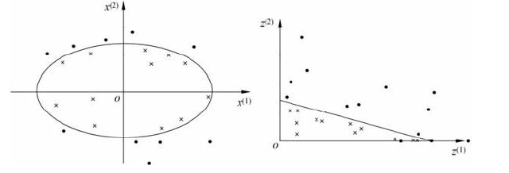
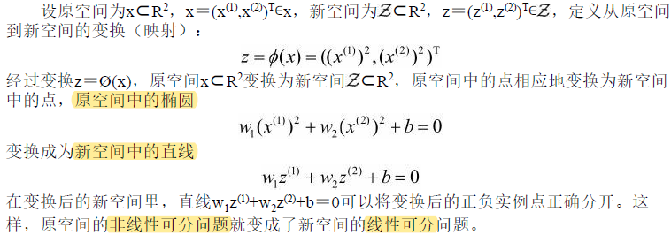
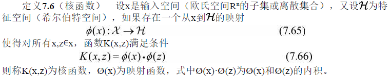
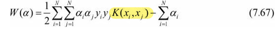
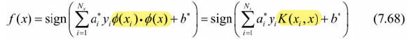
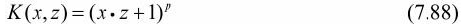
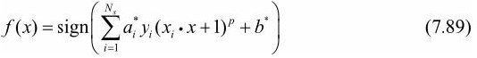
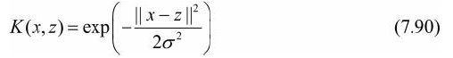
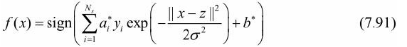

## 第7章 支持向量机

- 上节笔记完成了[线性支持向量机](./线性支持向量机SVM.md)
- 本节讲述非线性支持向量机

## 7.3 非线性支持向量机与核函数

### 7.3.1 核技巧

#### 非线性分类问题

- 非线性分类问题是指通过利用非线性模型才能很好地进行分类的问题

  

  - 如上图，无法用直线（线性模型）将正负实例正确分开，但可以用一条椭圆曲线（非线性模型）将
    它们正确分开

- 非线性可分问题：利用**超曲面**将正负例数据正确分离

- **非线性问题往往不好求解**，所以希望能用解**线性分类**问题的方法解决这个问题

  - 采取的方法是进行一个**非线性变换**，将非线性问题变换为线性问题，通过解**变换后**的**线性**问
    题的方法求解**原来**的**非线性**问题

  - 非线性变化**例子**：

    

- 可见，利用线性分类方法求解非线性分类有两个步骤：

  - 首先使用一个**变换**将原空间的数据**映射**到新空间
  - 在新空间里用**线性分类**学习方法从训练数据中学习分类模型

- 总结，**核技巧**就类似于上述的变换：

  - 通过一个**非线性变换**将输入空间（欧氏空间 $R^n$ 或离散集合）对应于一个特征空间（希尔伯特空间 $\H$ ）
  - 使得在输入空间 $R^n$ 中的**超曲面**模型对应于特征空间 $\H$ 中的**超平面**模型（支持向量机）

#### 核函数的定义

- **核函数定义** $7.6$ 

  

- **核技巧的想法是，在学习与预测中只定义核函数 $K(x,z)$ ，而不显式地定义映射函数 $\phi$** 

  - 直接计算 $K(x,z)$ 比较容易，而通过 $\phi(x)$和 $\phi(z)$ 计算 $K(x,z)$ 并不容易
  - $\phi$ 是输入空间 $R^n$ 到特征空间 $\H$ 的映射，特征空间一般是高维的，甚至是无穷维的，所以先计算映射的话可能在高维度进行，**计算量非常大** 
  - 对于给定的核 $K(x,z)$，特征空间和映射函数 $\phi$ 的取法并不唯一，可以取不同的特征空间，即便是在同一特征空间里也可以取不同的映射
  - 举例可见：[椭圆数据空间维度转换](https://www.cuijiahua.com/wp-content/uploads/2017/11/ml_9_12.png) 

#### 核技巧在支持向量机中的应用

- 有了核技巧，可以对线性支持向量机中的内积 $x_i \cdot x_j$ 用核函数 $ K(x_i, x_j) = \phi(x_i) \cdot \phi(x_j)$ 代替，所以**对偶问题**的目标函数成为：

  

- 分类决策函数中的内积也可以用核函数代替，而分类决策函数式成为

  

  - 这等价于经过映射函数 $\phi$ 将原来的输入空间变换到一个新的特征空间，将输入空间中的内积 $x_i \cdot x_j$ 变换为特征空间中的内积 $\phi(x_i) \cdot \phi(x_j)$ ，在新的特征空间里从训练样本中学习**线性**支持向量机
  - 当**映射函数是非线性函数**时，学习到的含有核函数的支持向量机是**非线性分类模型** 

- 所以，在核函数 $K(x,z)$ 给定的条件下，可以利用**解线性分类问题的方法求解非线性分类问题**的支持向量机

  - **隐式地**在**特征空间**进行的，不需要**显式**地定义特征空间和映射函数，减少大量的计算

### 7.3.3 常用核函数

- 多项式核函数（polynomial kernel function）

  

  - 对应的支持向量机是一个p次多项式分类器。在此情形下，分类决策函数成为

    

- 高斯核函数（Gaussian kernel function）

  

  - 对应的支持向量机是**高斯径向基函数**（radial basis function，RBF）分类器。在此情形下，分类
    决策函数成为

    

- 字符串核函数（string kernel function）

# 参考资料

- [李航《统计学习方法》第七章]()

