# 第14章 聚类方法

- 聚类是什么
  - 针对给定的样本，依据它们特征的**相似度**或**距离**，将其归并到若干个类或簇的数据分析问题
- 聚类的目的
  - 通过得到的类或簇来发现数据的特点或对数据进行处理，在数据挖掘、模式识别等领域有着广泛的作用
- 聚类属于**无监督学习** 
  - 根据相似度或距离划分，初始时多少类并不知道
- 聚类算法：
  - 层次聚类（hierarchical clustering）
    - **聚合法**：**自下而上**，即开始时将**每个**样本各自分为**一个类**，之后将相距**最近**的两类**合并**，建立一个**新的类**，**重复**此操作直至满足条件，得到层次化的类别
    - **分裂法**：**自上而下**，即开始时将**所有**样本归为**一类**，之后将已有的类中距离相距**最远**的样本**分**到两个新的类，**重复**此操作直至满足条件，得到层次化的类别
  - k均值聚类（k-means clustering）：基于中心的聚类，通过迭代，将样本分到 $ k $ 个类中，使得每个样本与其所属类的中心或均值最近，得到 $ k $ 个平坦的、非层次化的类别，构成对空间的划分

## 14.1 聚类的基本概念

### 14.1.1 相似度或距离

- 聚类的对象是观测数据或样本集合。假设有 $ n $ 个样本，每个样本有 $  m $ 个属性的特征向量组成。样本集合表示为:

  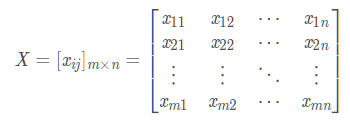

  - 元素 $ x_{ij} $ 表示第 $ i $ 个样本第 $ j $ 个属性，$i = 1 , 2 , ..., n, j = 1, 2, ..., m$ 

- 聚类的核心概念是相似度或距离，有多种相似度或距离的定义。因为相似度直接影响聚类的结果，所以其选择是聚类的根本问题

#### 闵可夫斯基距离

-  在聚类中，可以将样本集合想象成向量空间中的点，以该空间的距离表示样本之间的相似度

  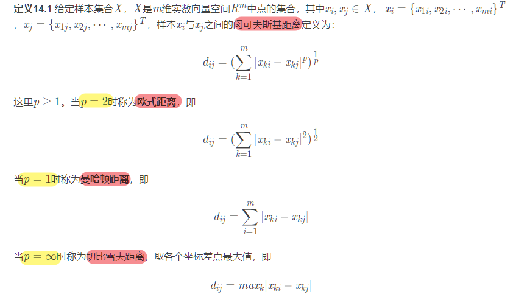

#### 马哈拉诺比斯距离（马氏距离）

- 考虑各个分量(特征)之间的相关性并与各个分量的尺度无关

- 马氏**距离越大相似度越小，距离越小相似度越大** 

  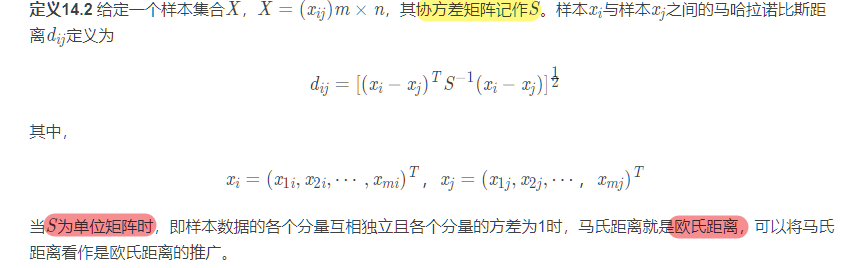

#### 相关系数

- 相关系数的绝对值越接近于**1**，表示样本越相似

- 相关系数的绝对值越接近于**0**，表示样本越不相似

  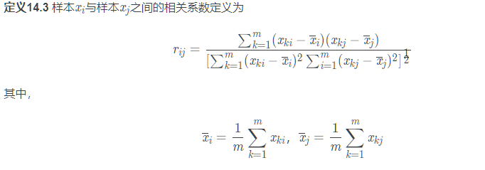

#### 夹角余弦

- 夹角余弦越接近于**1**，表示样本越相似

- 夹角余弦越接近于**0**，表示样本越不相似

  

### 14.1.2 类或簇

- 通过聚类得到的类或簇，本质是样本的子集

  - **硬聚类方法**：一个聚类方法假定一个样本**只能属于一个类**，或类的**交集为空集** 
  - **软聚类方法**：一个聚类方法假定一个样本可以属于**多个类**，或类的交集**不为空集** 

  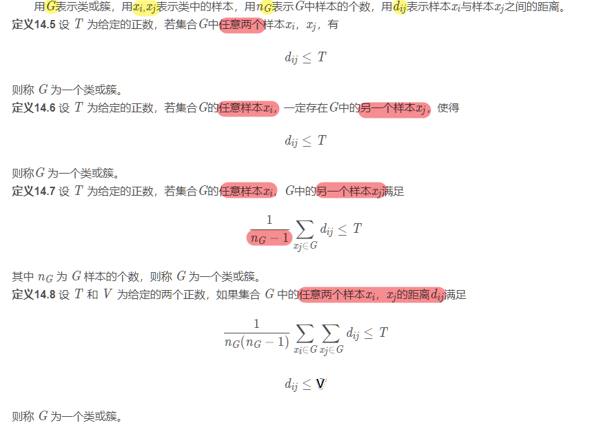

- **类的特征**可以通过不同角度来刻画，常用的特征有下面三种

  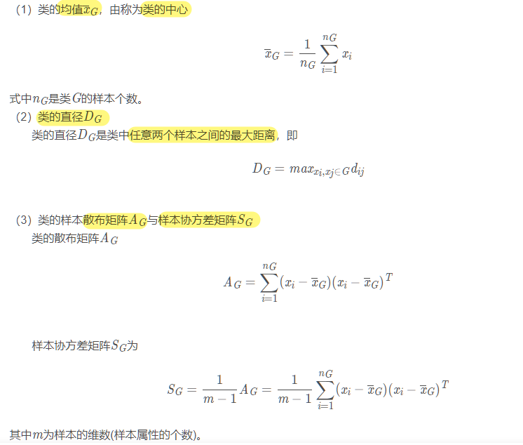

### 14.1.3 类与类之间的距离

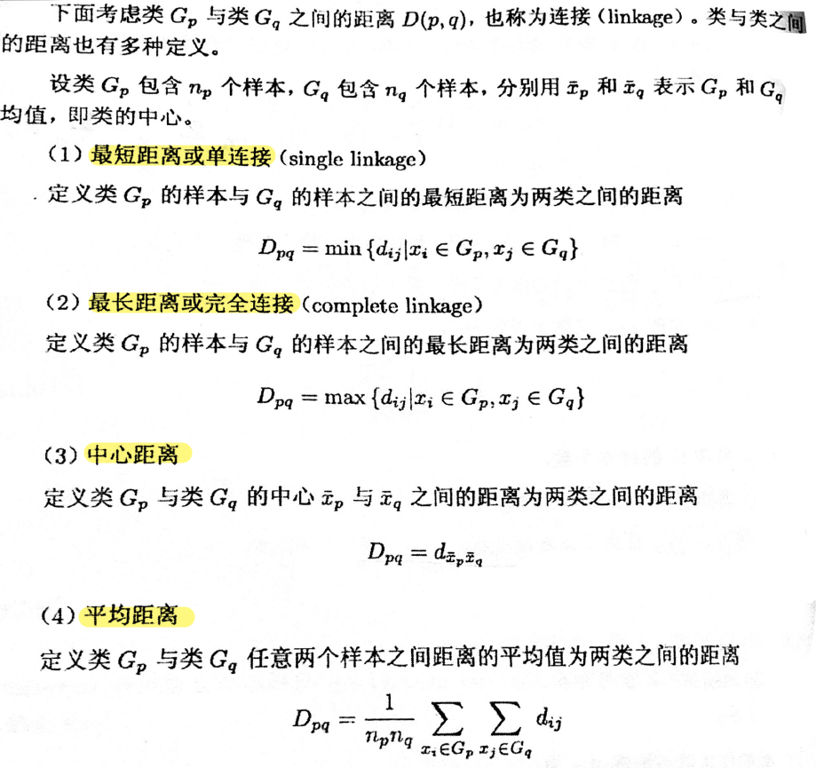

## 14.2 层次聚类

#####  聚合聚类算法

- 聚合聚类开始将每个样本各自分为**一个类**，之后将**距离最近**的两个类**合并**，建立一个**新类**，重复此操作直至满足停止条件，得到层次化的类别

- 具体步骤：
  - 输入：$ n $ 个样本组成的样本集合及样本之间的距离

  - 输出：对样本集合的一个层次化聚类

    1. 计算 $ n $ 个样本两两之间的欧氏距离 $ d_{ij} $ ，记作矩阵 $ D= [d_{ij}]_{n×n} $ 

    2. 构造 $ n $ 个类，每个类只包含一个样本

    3. 合并类间距离最小的两个类，其中**最短距离为类间距离**，构建一个新的类

    4. 计算新类与当前各类的距离，若类的个数为1，终止计算，否则回到(3)

  - 聚合层次聚类算法的复杂度为 $ O(n^3m) $ ，其中 $ m $ 是样本的维数，$n$ 是样本个数

#### 分裂聚类算法

- 分裂聚类算法开始将所有样本分为**一个类**，之后将已有类中**距离最远**的样本**分**到两个新类，重复此操作直至满足停止条件，得到层次化的类别
- 具体步骤：
  - 输入：$ n $ 个样本组成的样本集合及样本之间的距离
  - 输出：对样本集合的一个层次化聚类
    1. 计算 $ n $ 个样本两两之间的欧氏距离 $ d_{ij} $ ，记作矩阵 $ D= [d_{ij}]_{n×n} $ 
    2. 将样本集中的所有的样本归为一个类
    3. 在同一个类 $ c $ 中计算两两样本之间的距离，找出距离最远的两个样本 $ a $ 和 $ b $ ，之后将样本 $ a $ 和 $ b $ 分配到不同的类 $ c1 $ 和 $ c2 $ 中
    4. 计算原类 $c$ 中剩余的其他样本点和 $ a $ 和 $ b $ 的距离，若是 $ distance(a)<distance(b) $ ，则将样本点归到 $ c1 $  中，否则归到 $ c2 $ 中
    5. 重复步骤4直至达到聚类的数目或者达到设定的条件

## 14.3 $ k $ 均值聚类

- $ k $ 均值聚类将样本集合划分为 $ k $ 个子集，构成 $ k $ 个类，将 $ n $ 个样本分到 $ k $ 个类中，每个样本到其**所属类的中心的距离最小**  
- k均值聚类属于**硬聚类**，每个样本属于一个类 

### 14.3.1 模型

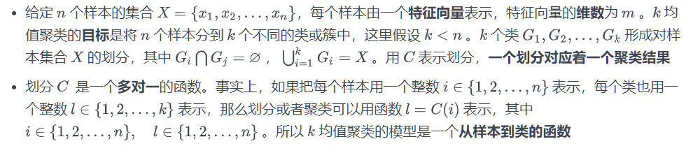

### 14.3.2 策略

- $ k $ 均值聚类的策略是**通过损失函数最小化**选取最优的划分或函数 $C^* $  

- 采用**欧氏距离平方**作为样本之间的距离

  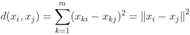

- 定义**样本**与其**所属类**的**中心**之间的距离的总和为损失函数

  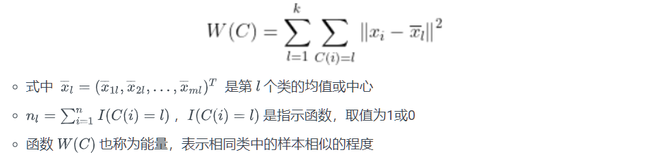

- $k $ 均值聚类就是**求解最优化问题**：

  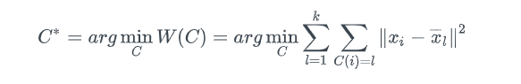

  - 相似的样本被聚到同类时，损失函数值最小，这个目标函数的最优化能达到聚类的目的

- 该优化问题是 $ n $ 个样本分到 $k$ 个类，所有可能**分法数量**：

  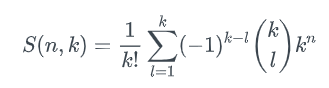

  

  - 该数量是指数级的，采用迭代求解

### 14.3.3 算法

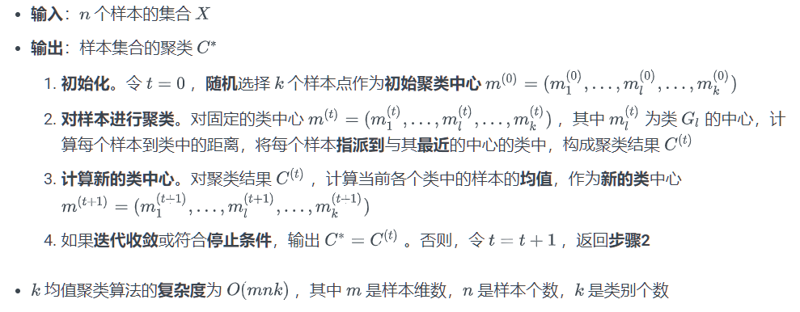

### 14.3.4 算法特性

- **总体特点** 
  - 基于**划分**的聚类算法
  - 类别数 $k$ **事先指定** 
  - 以**欧氏距离平方**表示样本之间的距离，以**中心**或样本的**均值**表示类别
  - 以样本和其所属类的中心之间的距离的**总和**为最优化的目标函数
  - 得到的类别是**平坦的、非层次化**的
  - 算法是**迭代**算法，**不**能保证全局最优
- **收敛性** 
  - **启发式**算法，无法保证全局最优
  - **初始中心点的选择会影响聚类结果** 
  - 类中心随着训练移动，但是移动**不会太大**，因为在每一步中，样本分到与其最近的中心的类中
- **初始类的选择** 
  - 选择不同的初始中心，会得到不同的聚类结果
  - 初始中心的先用**层次聚类**对样本进行聚类，得到 $ k $ 个类是停止
- **类别数 $k$ 的选择 **
  - 尝试用**不同**的 $k$ 值聚类
  - 一般而言，类别数变小时，平均直径会增加，类别数变大超过**某一个值**时，平均直径不变，即得到最优的 $k$ 值

